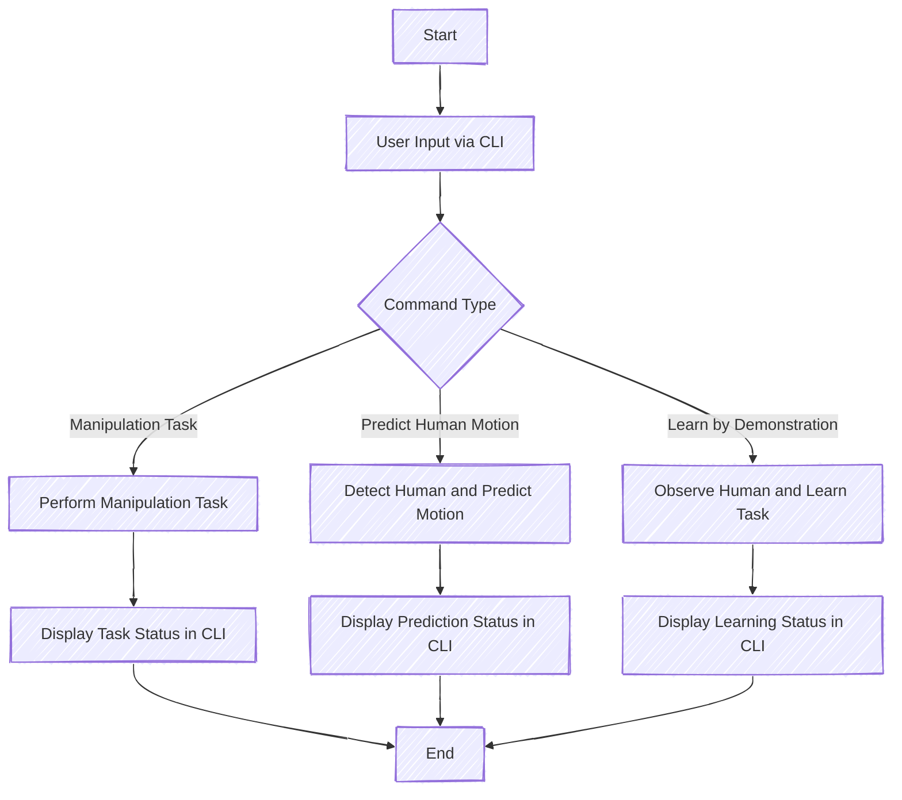
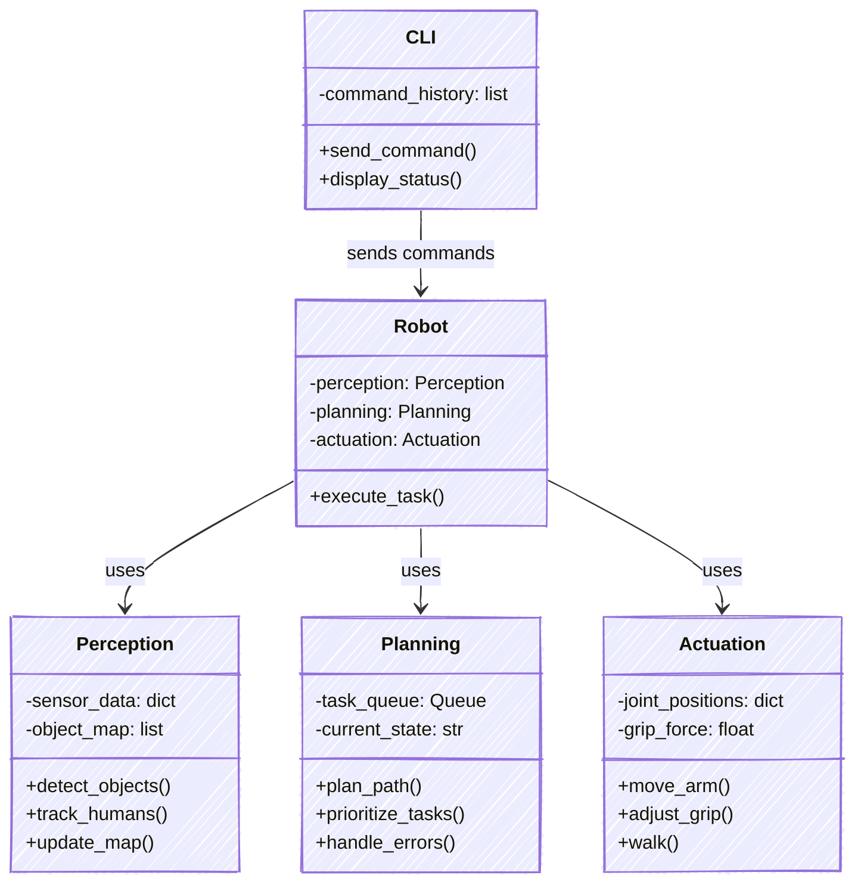
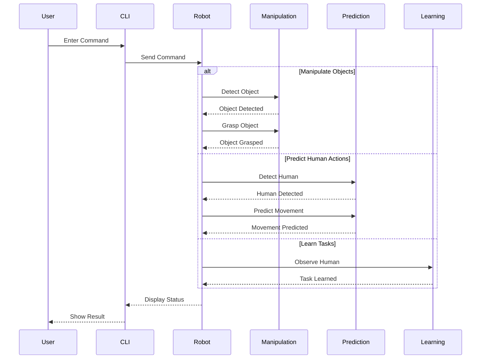

# UML Models for a Humanoid Robot

## Activity Diagram

```mermaid
---
config:
  look: handDrawn
  theme: default
  layout: dagre
---

flowchart TD
    A[Start] --> B[User Input via CLI]
    B --> C{Command Type}
    C -->|Manipulation Task| D[Perform Manipulation Task]
    C -->|Predict Human Motion| E[Detect Human and Predict Motion]
    C -->|Learn by Demonstration| F[Observe Human and Learn Task]
    D --> G[Display Task Status in CLI]
    E --> H[Display Prediction Status in CLI]
    F --> I[Display Learning Status in CLI]
    G --> J[End]
    H --> J
    I --> J
```

## Class Diagram

```mermaid
---
config:
  look: handDrawn
  theme: default
  layout: dagre
---

classDiagram
    class Perception {
        -sensor_data: dict
        -object_map: list
        +detect_objects()
        +track_humans()
        +update_map()
    }

    class Planning {
        -task_queue: Queue
        -current_state: str
        +plan_path()
        +prioritize_tasks()
        +handle_errors()
    }

    class Actuation {
        -joint_positions: dict
        -grip_force: float
        +move_arm()
        +adjust_grip()
        +walk()
    }

    class CLI {
        -command_history: list
        +send_command()
        +display_status()
    }

    class Robot {
        -perception: Perception
        -planning: Planning
        -actuation: Actuation
        +execute_task()
    }

    CLI --> Robot : sends commands
    Robot --> Perception : uses
    Robot --> Planning : uses
    Robot --> Actuation : uses
```

## Sequence Diagram

```mermaid
---
config:
  look: handDrawn
  theme: default
  layout: dagre
---
sequenceDiagram
    participant User
    participant CLI
    participant Robot
    participant Manipulation
    participant Prediction
    participant Learning

    User->>CLI: Enter Command
    CLI->>Robot: Send Command
    alt Manipulate Objects
        Robot->>Manipulation: Detect Object
        Manipulation-->>Robot: Object Detected
        Robot->>Manipulation: Grasp Object
        Manipulation-->>Robot: Object Grasped
    else Predict Human Actions
        Robot->>Prediction: Detect Human
        Prediction-->>Robot: Human Detected
        Robot->>Prediction: Predict Movement
        Prediction-->>Robot: Movement Predicted
    else Learn Tasks
        Robot->>Learning: Observe Human
        Learning-->>Robot: Task Learned
    end
    Robot-->>CLI: Display Status
    CLI-->>User: Show Result

```

## State Transition Diagram

```mermaid
---
config:
  look: handDrawn
  theme: default
  layout: dagre
---
sequenceDiagram
    participant User
    participant CLI
    participant Robot
    participant Manipulation
    participant Prediction
    participant Learning

    User->>CLI: Enter Command
    CLI->>Robot: Send Command
    alt Manipulate Objects
        Robot->>Manipulation: Detect Object
        Manipulation-->>Robot: Object Detected
        Robot->>Manipulation: Grasp Object
        Manipulation-->>Robot: Object Grasped
    else Predict Human Actions
        Robot->>Prediction: Detect Human
        Prediction-->>Robot: Human Detected
        Robot->>Prediction: Predict Movement
        Prediction-->>Robot: Movement Predicted
    else Learn Tasks
        Robot->>Learning: Observe Human
        Learning-->>Robot: Task Learned
    end
    Robot-->>CLI: Display Status
    CLI-->>User: Show Result

```